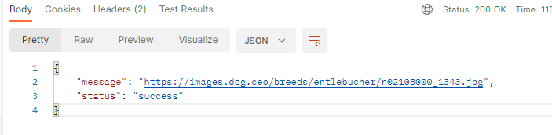

# Overview

This is just a simple Quarkus application that integrates with an API that generates random dog images.

## Links

API Documentation: [Dog API](https://dog.ceo/dog-api/?ref=apispublicas.com)

## The challenge

The challenge was to build a quarkus application with the RestEasy React extersion and Microprofile Annotations to integrate with other systems.

## Screenshot

### Built With:

- Java
- Quarkus Framework

